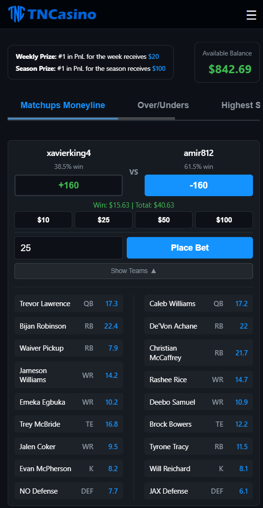
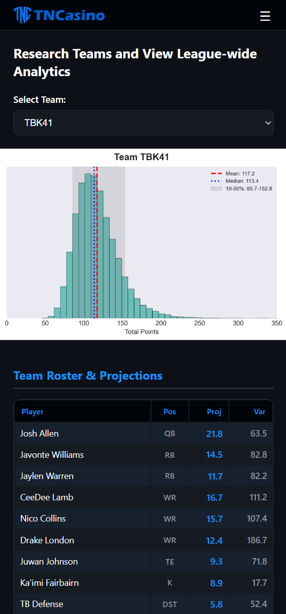
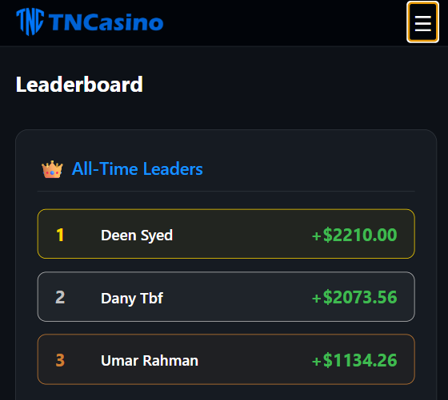

# TNCasino: Fantasy Football Analytics & Fake Betting Platform

---

## TLDR

TNCasino is a Fanduel but with fake money for betting on the outcomes of my fantasy league (named TNC). 

Data comes from 5 different fantasy football/betting projections sources. The data from those sources gets scraped, heavily cleaned, and used to create the distribution parameters for the simulations. Simulations get ran and the results of those simulations are used to create betting odds.

**From Projections to Odds:**

For each team, player projections (μ, σ) are aggregated from multiple sources. Here's how the parameters are calculated:

**1. Mean Projection (μ):**
$$\mu = \text{mean}(\text{projections across all sources})$$

**2. Standard Deviation (σ):**
Uncertainty is modeled as a combination of source disagreement and inherent position variance:

$$\sigma = \sqrt{(\alpha \cdot s)^2 + (\beta \cdot \sigma_{\text{pos}})^2}$$

Where:
- **s** = sample standard deviation of projections across sources (ddof=1)
- **σ_pos** = baseline uncertainty by position (QB: 7.0, RB: 9.0, WR: 10.0, TE: 8.0, K: 4.0, DST: 7.0. Got these from some quick searches, will update later)
- **α** = 2.0 (weight for source disagreement)
- **β** = 1.0 (weight for baseline position variance)

**3. Variance:**
$$\text{var} = \sigma^2$$

**4. Monte Carlo Simulation** (50,000 iterations):
   - Sample team totals: $T_1 \sim \text{Lognormal}(\mu_1, \sigma_1)$, $T_2 \sim \text{Lognormal}(\mu_2, \sigma_2)$

**5. Win Probability**:
   $$P_1 = \frac{\text{count}(T_1 > T_2)}{50,000}$$

**6. American Odds**:
   $$\text{ML}_1 = \begin{cases} 
   -\frac{100P_1}{1-P_1} & \text{if } P_1 \geq 0.5 \\
   +\frac{100(1-P_1)}{P_1} & \text{if } P_1 < 0.5
   \end{cases}$$


So:
- A QB that is projected for 13-15 points by every source will have a low mean but low variance
- A WR with projections of 10, 12, 18, and 21 will have a higher mean but may actually result in lower odds to win than if they were swapped out with the QB, depending on the team around them.

# **[Visit TNCasino.win](https://tncasino.win)**

## Betting Interface



Each bet allows you to see the players on the teams in question, allowing for non-league members to place bets. The season-long leader in PnL was not a league member!


## Team Analytics & Statistical Distributions



There a ton of cool charts I create every week, most of which don't make it to the site but I will change that next year

## Leaderboard & Performance Tracking



The leaderboard displays all-time and weekly top performers, even worst/bet bets.

## Lessons learned

Not that I didn't know this, but data cleaning is very time-consuming! that's where most of the leg-work in this project went. 
I typically make the odds on Tuesday or Wednesday to close at Thursday Night kickoff, but someone might not even pick up a replacement for their kicker whos on bye until Saturday. 

To fix this, I created the concept of a "replacement player", the x (x is configurable based on your league size) best player at that position. If a team's "best" lineup (based on projection mean) has a player that is projected to score less than the "replacement player", then the replacement player's stats are inserted in for that position. 

This works surprisingly well lol

## Technical Architecture

### Data Pipeline

```
1. League Data Collection → Sleeper API integration
2. Projection Scraping → Multi-source web scrapers (Selenium/Playwright)
3. Data Standardization → Name matching, position normalization
4. Statistical Analysis → Mean/variance calculations per player
5. Lineup Optimization → Optimal roster construction
6. Monte Carlo Simulation → 50,000 iterations per week
7. Odds Generation → Probability-to-odds conversion
8. Web Dashboard → Flask backend with interactive frontend
```

### Technology Stack

- **Backend**: Python, Flask, SQLite
- **Data Processing**: Pandas, NumPy, Jupyter Notebooks
- **Web Scraping**: Selenium, Playwright
- **Statistical Modeling**: Custom Monte Carlo implementation
- **Frontend**: HTML/CSS/JavaScript, responsive design
- **Visualization**: Matplotlib, Plotly (for static images)

### Database Schema

The platform uses multiple SQLite databases:
- **Projections Database**: Multi-source player projections with timestamps
- **League Database**: Teams, rosters, matchups, player stats
- **User Database**: Authentication, betting history, balances

---

## 📈 Project Structure

```
├── backend/
│   ├── notebooks/              # Data processing pipeline
│   │   ├── 01_league_control.ipynb          # League data collection
│   │   ├── 02_projections_control.ipynb     # Multi-source scraping
│   │   ├── 03_post_scraping_processing.ipynb # Data cleaning
│   │   ├── 04_match_projections_to_sleeper.ipynb # Player matching
│   │   ├── 05_compute_player_week_stats.ipynb    # Statistical analysis
│   │   ├── 06_team_lineup_optimizer.ipynb       # Lineup optimization
│   │   └── 07_monte_carlo_simulations.ipynb     # 50K simulations
│   ├── scrapers/               # Web scraper modules
│   │   ├── scraper_fanduel.py
│   │   ├── scraper_sleeper.py
│   │   ├── scraper_fantasypros.py
│   │   ├── scraper_espn.py
│   │   └── scraper_firstdown.py
│   └── data/
│       ├── csv/                # Data exports
│       ├── images/             # Generated visualizations
│       └── databases/          # SQLite databases
├── frontend/
│   ├── templates/              # Flask HTML templates
│   │   ├── betting.html        # Matchup betting interface
│   │   ├── analytics.html      # Team research dashboard
│   │   ├── leaderboard.html    # Performance rankings
│   │   └── ...
│   └── static/
│       └── images/             # Web assets
├── app/                        # Flask application package
│   ├── __init__.py             # App factory + gunicorn entry point
│   ├── auth.py                 # Google OAuth + login manager
│   ├── database.py             # SQLAlchemy instance
│   ├── models.py               # Database models
│   └── routes/                 # Blueprints (pages, betting, odds, admin, account)
├── scripts/                    # Standalone CLI tools
│   ├── publish.py              # Push local SQLite to production PostgreSQL
│   ├── scrape.py               # Orchestrate all scrapers
│   └── validate_scraping.py    # Check projection data quality
└── requirements.txt            # Python dependencies
```

---

## Running this yourself

### Installation

```bash
# Clone the repository
git clone <repository-url>
cd "Claude Model"

# Install dependencies
pip install -r requirements.txt

# Install Playwright browser (for FanDuel scraper)
playwright install chromium
```

### Configuration

Create a `.env` file with your Sleeper credentials:

```
SLEEPER_USERNAME=your_username
LEAGUE_ID=your_league_id
```

### Running the Pipeline

The data processing pipeline runs through Jupyter notebooks in numbered sequence:

1. **League Control**: Fetch Sleeper league data
2. **Projections Control**: Scrape projections from all sources
3. **Post-Scraping Processing**: Clean and standardize data
4. **Match to Sleeper**: Link projections to Sleeper player IDs
5. **Player Stats**: Calculate mean/variance for each player
6. **Lineup Optimizer**: Generate optimal lineups
7. **Monte Carlo**: Run 50,000 simulations and generate odds

That will create the db files. Push the ones you need, not the monte carlo one because it's too big.

then run
```bash
python -m app
```

email me for more information if you do want to do this yourself

---

## Future Enhancements

Potential improvements (if I continue developing):
- Machine learning models for player projection refinement
- Historical accuracy tracking of projections
- Advanced betting strategies (parlays, teasers)
- Real-time data updates after TNF so that we can bet until sunday
- Actual production tables instead of uploading .db files
- API endpoints for programmatic access

---

## Notes

**This project was built purely for fun as an analytical side project.** It combines my interests in:
- Fantasy football strategy
- Statistical modeling and simulation
- Web development and user experience
- Data engineering and ETL pipelines

The codebase reflects iterative development and experimentation rather than production-ready engineering. It's a demonstration of curiosity-driven learning and applying data science techniques to a domain I'm passionate about.

---

## License

This project is for personal/educational use.


*Built with Python, Flask, and a lot of curiosity about fantasy football statistics.*
